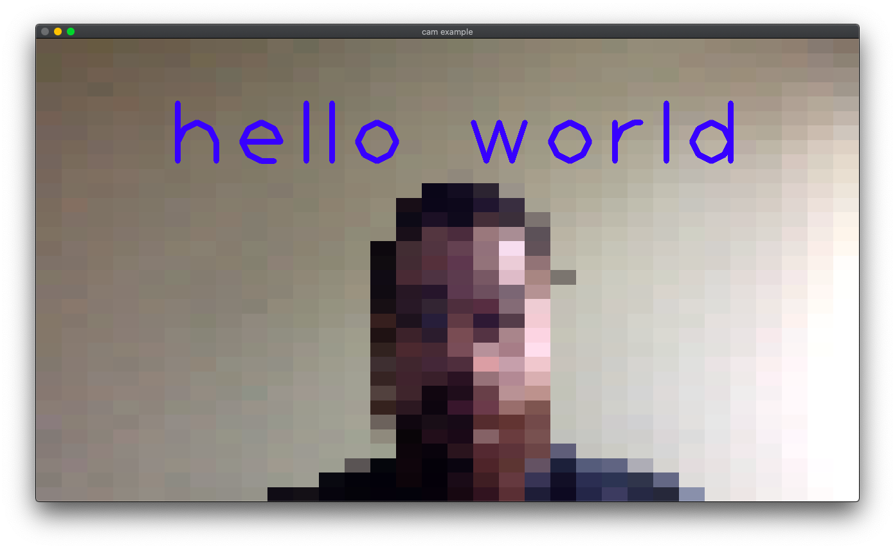

# cam

[](https://godoc.org/github.com/mvrilo/cam)
[](https://goreportcard.com/report/github.com/mvrilo/cam)

`cam` is a package for Go that provides a high level api (similar to `net/http`) and a small set of plugins for working with camera frames. For the device communication, implementing the `Device interface`, we use [GoCV](https://gocv.io/) and [OpenCV](https://opencv.org/), more can be easily added. Contributions are welcomed.

## Dependencies

- For the `gocv` device implementation you will only need [OpenCV](https://docs.opencv.org/4.4.0/) installed. You can see instructions for installation on [the opencv docs](https://docs.opencv.org/4.4.0/df/d65/tutorial_table_of_content_introduction.html) and [in the GoCV page](https://gocv.io/getting-started/).

## Installation

```
go get github.com/mvrilo/cam
```

## Example

```go
package main

import (
	"image"
	"image/color"
	"log"

	"github.com/mvrilo/cam"
	"github.com/mvrilo/cam/middlewares/pixelize"
	"github.com/mvrilo/cam/middlewares/window"
	"gocv.io/x/gocv"

	_ "github.com/mvrilo/cam/gocv"
)

func main() {
	cam.Use(pixelize.New(32))
	cam.Handle(func(f cam.Frame) {
		text := "hello world"
		blue := color.RGBA{0, 0, 255, 0}
		data, ok := f.Data().(gocv.Mat)
		if !ok {
			return
		}
		gocv.PutText(&data, text, image.Pt(200, 200), gocv.FontHersheyPlain, 10, blue, 8)
	})
	cam.Use(window.New("cam example"))
	log.Fatal(cam.ListenAndServe(0, nil))
}
```



## Author

Murilo Santana <<mvrilo@gmail.com>>
